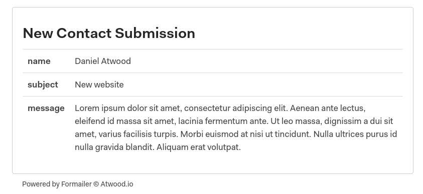

# Formailer




If you need your contact form to send you an email but don't need to store form submissions, then Formailer is the serverless library for you!

## Quickstart

No matter what hosting platform you are using. The initial setup is the same.
```go
import (
	"github.com/djatwood/formailer"
	"github.com/djatwood/formailer/handlers"
	
	// For Netlify
	"github.com/aws/aws-lambda-go/lambda"
)


func main() {
	forms := make(formailer.Config)
}
```
Then add your emails settings. You can add multiple emails per form.
```go
...
forms.Add("Contact", formailer.Email{
	ID:      "contact",
	To:      "info@domain.com",
	From:    `"Company" <noreply@domain.com>`,
	Subject: "New Contact Submission",
})
forms.Add("Quote", formailer.Email{
	ID:      "quote",
	To:      "sales@domain.com",
	From:    `"Company" <noreply@domain.com>`,
	Subject: "New Quote Request",
})
```
And run your handler.
```go
// Vercel
handlers.Vercel(forms, w, r)
// Netlify
lambda.Start(handlers.Netlify(forms))
```
If you want to use your own handler that's not a problem either. [View an example handler](#user-content-custom-handlers).

Last you update your form. So that we can use the correct form config you need to add the form name as a hidden input with the name `_form_name`.

Formailer supports submitting forms as `application/x-www-form-urlencoded`, `multipart/form-data`, or `application/json`.

The built-in handlers come with built in Google reCaptcha verification if you add a `RECAPTCHA_SECRET` to your environment variables.
```html
<!-- html form -->
<input type="hidden" name="_form_name" value="contact">
<button class="g-recaptcha" data-sitekey="reCAPTCHA_site_key" data-callback='onSubmit' data-action='submit'>Submit</button>
```
```javascript
// JSON object
{
	...
	"_form_name": "contact",
}
```

## Customization

You can customize Formailer to suit your needs. You can add as many forms as you'd like. As long as they have unique names. Each form can have it's own email template and SMTP settings. But if you want to set defaults for everything you can.
### SMTP

All of your SMTP variables must be saved in the environment. You can add as many configs as you have emails. And you can save a default config to fallback on. Note that if you have default config you don't need to specify every option again. Any missing options will fallback to the default.

If you build your own handler you can store the config anywhere you want. Just pass a `*mail.SMTPServer` to `submission.Send(server)` and you're good to go.

```env
# Default
SMTP_HOST=mail.example.com
SMTP_PORT=587
SMTP_USER=noreply@example.com
SMTP_PASS=mysupersecretpassword

# Overrides
# _HOST and _PORT will fallback to the default above
SMTP_EMAIL-ID_USER=support@example.com
SMTP_EMAIL-ID_PASS=youcantguessthispassword
```

### Templates
Here is the default template. It hides all inputs with names starting with `_`.


You can override this template on any form by using the `Template` field.
```go
forms.Add("form", formailer.Email{
	...
	Template: defaultTemplate,
}

defaultTemplate := `
<html>
<head>
    <style>
        h3 {
            color: #000;
            margin-bottom: 5px;
        }

        p {
            color: #333;
            margin-bottom: 2rem;
        }
    </style>
</head>
<body>
    {{ range $name, $value := .Values }}
    <h3>{{$name}}</h3>
    <p>{{$value}}</p>
    {{ end }}
</body>
</html>
`
```

### Custom Handlers
Formailer ships with Netlify and Vercel handlers but if you need more control over the data. Or would like to run on a different platform, it's not too difficult to get setup. Here is a template to get you started.
```go
func Handler(w http.ResponseWriter, r *http.Request) {
	// pre-processing, check HTTP method

	// convert body from io.Reader to string
	body := new(strings.Builder)
	_, err := io.Copy(body, r.Body)
	if err != nil {
		// handle error
		return
	}
	
	// Parse body
	submission, err := c.Parse(r.Header.Get("Content-Type"), body.String())
	// check for EOF when submitting as multipart/form-data
	if err != nil && err != io.EOF {
		// handle error
		return
	}

	// manipulate data, check honey pot fields

	// Send emails
	err = submission.Send()
	if err != nil {
		// handle error
		return
	}

	// handle success
}
```

## Why did I buid Formailer?

I love JAMStack. But it can get expensive pretty quickly. Netlify only allows for 100 form submissions a month but it does allows for 125k function calls per month. So I did the next logical thing.

Netlify barely supports Go, you can't even use the Netlify CLI to test Go functions. Every change had to be commited and tested directly on Netlify. The bad part is I had minimal experience working with multipart forms before this project. And [Hoppscotch](https://hoppscotch.io) doesn't implement multipart forms in a traditional way which led to a bunch of builds that I thought didn't work but actually did.

There's also an annoying bug with environment variables where [functions can't read variabes defined in the `netlify.toml`](https://github.com/netlify/netlify-lambda/issues/59). So you'll just have to add them all in the UI.

Later I switched to Vercel which was a huge breath of fresh air. Because you can test Go functions locally. Even though they say Go support is still in alpha.
